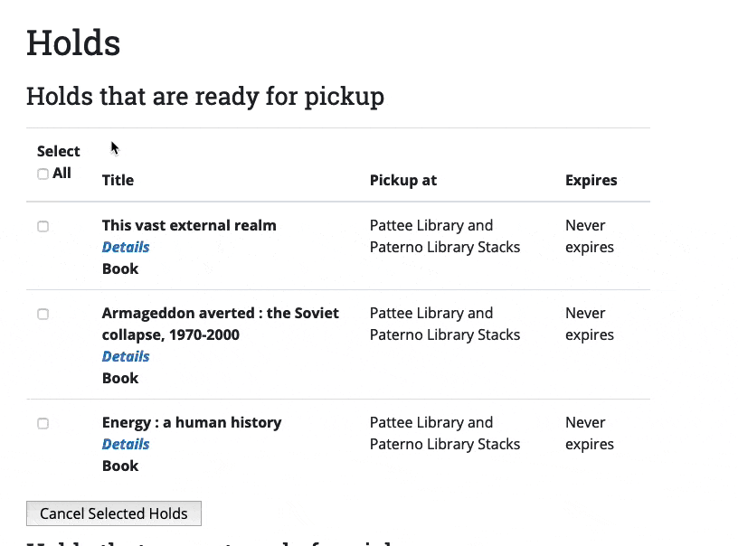

# Select All

This javascript utility will provide a mechanism for having one controlling checkbox select or de-select a set of controlled checkboxes. It depends on data dash attributes in your markup. The `.start()` method must be called - nothing else needs to be.

## Markup required

Controller checkbox must have:

`data-select-all=targetKeyword`

Controlled checkboxes must have:
  
`data-checkbox-type=targetKeyword`

## Example:

The `targetKeyword` is `ready`

```
<table class="table">
    <caption>Holds that are ready for pickup</caption>
    <thead>
      <tr>
        <th scope="col">
          Select <br>
          <input type="checkbox" name="ready_holds" id="ready_holds" value="1" data-select-all="ready">
          <label for="ready_holds">All</label>
        </th>
        <th scope="col">Title</th>
        <th scope="col">Pickup at</th>
        <th scope="col">Expires</th>
      </tr>
    </thead>
    <tbody>
        <tr>
          <td>
            <input type="checkbox" name="hold_list[]" id="hold_list_" value="3911275" data-checkbox-type="ready" class="checkbox" multiple="multiple">
            3911275<br>

          </td>
          <th scope="row">
            This vast external realm<br>
            <em><a href="https://catalog.libraries.psu.edu/catalog/873151">Details</a></em><br>
            Book
          </th>
          <td>Pattee Library and Paterno Library Stacks</td>
          <td>Never expires</td>
        </tr>
        <tr>
          <td>
            <input type="checkbox" name="hold_list[]" id="hold_list_" value="3911277" data-checkbox-type="ready" class="checkbox" multiple="multiple">
            3911277<br>

          </td>
          <th scope="row">
            Armageddon averted : the Soviet collapse, 1970-2000<br>
            <em><a href="https://catalog.libraries.psu.edu/catalog/2257167">Details</a></em><br>
            Book
          </th>
          <td>Pattee Library and Paterno Library Stacks</td>
          <td>Never expires</td>
        </tr>
        <tr>
          <td>
            <input type="checkbox" name="hold_list[]" id="hold_list_" value="3911287" data-checkbox-type="ready" class="checkbox" multiple="multiple">
            3911287<br>

          </td>
          <th scope="row">
            Energy : a human history<br>
            <em><a href="https://catalog.libraries.psu.edu/catalog/22343713">Details</a></em><br>
            Book
          </th>
          <td>Pattee Library and Paterno Library Stacks</td>
          <td>Never expires</td>
        </tr>
    </tbody>
  </table>
  ```
  Which yields:
  
  